<picture>
  <source media="(prefers-color-scheme: dark)" srcset="dark.svg">
  <source media="(prefers-color-scheme: light)" srcset="light.svg">
  
</picture>

 

## 🧑‍💻 About Me

- 🎓 Final-year **IT student** at PCCOER, Pune (lateral entry) - graduating **2027**
- 💼 Full Stack Developer with real internship experience shipping **production websites** and **real-time systems**
- 🧠 Led a 3-member team to build an **ML deepfake classifier** - 78% accuracy, 🥉 **3rd place** at PBL Poster Competition
- 🚀 Currently exploring **Networking, DevOps & Cybersecurity**, and leveling up in **DSA (C++)**, **React Native**, and **Generative AI**
- 🌱 Open to collaborating on **MERN stack**, **AI/ML integrations**, and **hackathon projects**
- ⚡ Fun fact: I make computers do what humans dream 💡

 

## 🛠️ Tech Stack

**Languages**
 

**Frontend**
 

**Backend & Databases**
 

**ML & Tools**
 

 

### 💬 Innovation is at the heart of my journey. Let's create something incredible together!

